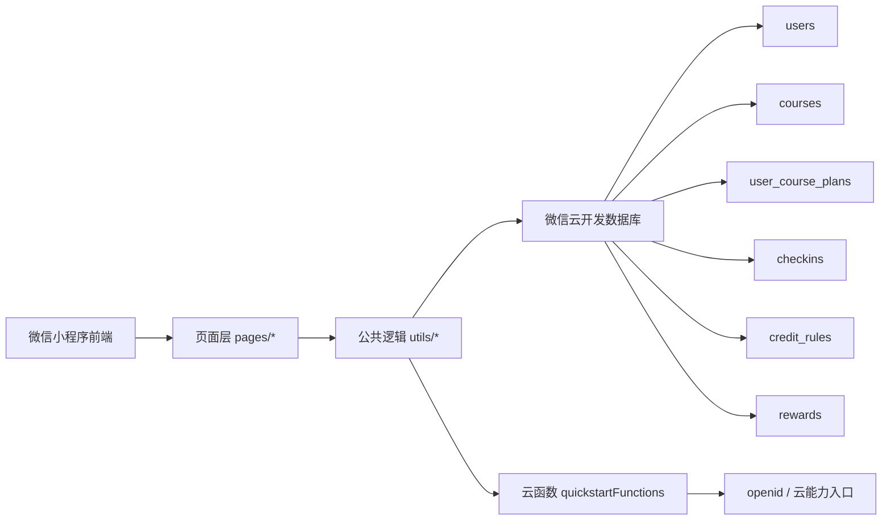

# 未雨课表

[](https://developers.weixin.qq.com/miniprogram/dev/framework/)
[](https://developers.weixin.qq.com/miniprogram/dev/wxcloud/basis/getting-started.html)
[](#后续规划-roadmap)
[](#license)

一个面向长期学习场景的微信小程序，用课程库、个人课表、每日打卡、学分规则、奖励目标和统计复盘，把“想学”真正变成“持续在学”。

## 项目亮点

- 不是传统学校课表，而是偏个人成长和长期自学的学习管理工具
- 把课程录入、课表排期、打卡记录、奖励反馈做成一个闭环
- 基于微信云开发实现，无需单独维护后端服务
- 个人核心数据按 `openid` 隔离，课程库支持共享复用

## 项目预览

未雨课表当前已经覆盖一个完整的学习闭环：

```text
课程录入 -> 课表编排 -> 每日打卡 -> 学分累计 -> 奖励进度 -> 统计复盘
```

它更适合以下场景：

- 自学型长期学习计划
- 在职提升、考证、转岗准备
- 需要稳定追踪投入与进度的个人学习管理
- 希望把课程、打卡、奖励和统计统一管理在微信里的轻量工具

## 功能概览

### 首页

- 今日学习安排
- 本周进度概览
- 主奖励进度展示
- 最近学习记录摘要
- 下一节课程提醒

### 课程与课表

- 共享课程库浏览
- 新增 / 编辑课程
- 课程详情查看
- 固定学习排期编排
- 已排课程分组展示

### 打卡与记录

- 上课打卡
- 下课打卡
- 学习记录沉淀
- 请假 / 休息 / 旷课状态管理
- 课程完成学分自动结算

### 个人中心与反馈

- 个人资料编辑
- 学分规则配置
- 奖励目标配置
- 数据统计中心
- 多主题界面切换

## 技术栈

- 前端：微信原生小程序
- 后端：微信云开发
- 数据库：云开发数据库
- 云函数：`quickstartFunctions`
- 登录机制：通过云函数获取当前微信用户 `openid`

## 系统架构



## 快速开始

### 1. 环境准备

- 安装微信开发者工具
- 开通微信云开发环境
- 准备一个可用的小程序 AppID

### 2. 拉起项目

在微信开发者工具中打开本项目根目录：

```text
weiyukebiao/
```

### 3. 配置云环境

当前代码中使用的云环境：

```text
cloud1-1g2x48ece3357f4f
```

配置文件位置：

- `miniprogram/app.js`

### 4. 部署云函数

当前云函数目录：

```text
cloudfunctions/quickstartFunctions
```

修改云函数后，需要在微信开发者工具中重新部署。

### 5. 运行验证建议

建议按下面顺序快速验证主流程：

1. 新建一门课程
2. 添加一条课表排期
3. 进入今日打卡页面执行上课 / 下课打卡
4. 填写学习记录
5. 查看首页、统计页和奖励进度是否同步更新

## 项目结构

```text
weiyukebiao/
├── cloudfunctions/
│   └── quickstartFunctions/   # 云函数，当前主要用于获取 openid
├── miniprogram/
│   ├── pages/                 # 页面代码
│   ├── utils/                 # 公共工具与业务逻辑
│   ├── app.js                 # 小程序启动入口
│   ├── app.json               # 页面与 tab 配置
│   └── app.wxss               # 全局样式
├── project.config.json        # 微信开发者工具配置
├── project.private.config.json
├── uploadCloudFunction.sh     # 云函数部署辅助脚本
└── README.md
```

## 页面说明

### Tab 页面

- `pages/home/index`：首页
- `pages/course/index`：课程与个人课表
- `pages/checkin/index`：今日打卡
- `pages/profile/index`：个人中心

### 非 Tab 页面

- `pages/course-detail/index`：课程详情
- `pages/course-edit/index`：新增 / 编辑课程
- `pages/schedule-edit/index`：新增 / 编辑课表排期
- `pages/profile-edit/index`：个人资料编辑
- `pages/reward-edit/index`：奖励目标设置
- `pages/credit-rule/index`：学分规则设置
- `pages/stats/index`：统计中心
- `pages/theme-settings/index`：主题切换

## 当前版本能力边界

当前版本已经具备主流程，但仍属于持续迭代中的产品版本。现阶段更偏重“学习闭环可用”，还没有把所有延展能力做全。

当前尚未完整展开的方向包括：

- 独立资料管理能力
- 更强的统计聚合与性能优化
- 更细粒度的排期与冲突处理
- 更完整的发布、权限与运维说明

## 数据设计

当前项目主要使用以下集合：

### `users`

用户资料表，按 `openid` 存储基础用户信息。

核心字段：

- `openid`
- `nickname`
- `avatarUrl`
- `intro`
- `createdAt`
- `updatedAt`

### `courses`

共享课程库，所有用户可见。

核心字段：

- `name`
- `category`
- `totalDuration`
- `description`
- `link`
- `materials`
- `tags`
- `notes`
- `colorKey`
- `colorName`
- `colorClass`

### `user_course_plans`

个人课表排期表，按 `openid` 隔离。

核心字段：

- `openid`
- `courseId`
- `courseName`
- `weekday`
- `weekdayLabel`
- `startDate`
- `endDate`
- `startTime`
- `endTime`
- `status`
- `note`

### `checkins`

学习打卡与学习记录表，按 `openid` 隔离。

核心字段：

- `openid`
- `planId`
- `courseId`
- `courseName`
- `dateKey`
- `status`
- `plannedMinutes`
- `actualMinutes`
- `studyNote`
- `leaveReason`
- `earnedCredits`
- `startedAt`
- `finishedAt`

### `credit_rules`

个人学习规则表，按 `openid` 隔离。

核心字段：

- `openid`
- `completionCredits`
- `deepStudyThreshold`
- `deepStudyBonus`
- `missedPenalty`
- `restMonthlyLimit`
- `manualAdjustment`

### `rewards`

个人奖励目标表，按 `openid` 隔离。

核心字段：

- `openid`
- `title`
- `targetCredits`
- `description`
- `manualAdjustment`

## 数据隔离策略

### 共享数据

- `courses`

### 用户隔离数据

- `users`
- `user_course_plans`
- `checkins`
- `credit_rules`
- `rewards`

当前登录流程：

1. 小程序启动后调用云函数 `quickstartFunctions`
2. 获取当前微信用户的 `openid`
3. 自动在 `users` 集合中创建或读取个人档案
4. 后续业务数据统一按 `openid` 隔离

## 主题系统

当前已内置 10 套主题配色：

- 草莓熊
- 松林绿
- 海盐蓝
- 焦糖杏
- 石墨灰
- 夜幕黑
- 雾紫
- 薄荷青
- 酒红
- 沙丘金

主题入口：

```text
我的 -> 界面配色
```

## 运行说明

### 小程序端

- 页面配置见 `miniprogram/app.json`
- 采用原生小程序页面结构开发
- 已启用 `lazyCodeLoading: "requiredComponents"`

### 云函数端

当前 `quickstartFunctions` 主要承担：

- 获取当前用户 `openid`
- 提供基础的云开发示例能力

如果项目继续演进，建议将统计、聚合和复杂查询逻辑逐步下沉到云函数侧。

## 后续规划 Roadmap

- [ ] 将统计与聚合计算逐步下沉到云函数
- [ ] 优化课表与打卡页的数据查询性能
- [ ] 增强课程资料管理能力
- [ ] 丰富统计中心的维度与可视化
- [ ] 补齐更正式的发布与部署文档

## 仓库说明

这个仓库目前更适合作为产品开发项目与作品展示仓库使用：

- 可以直接在微信开发者工具中打开并继续开发
- 适合展示完整的小程序业务闭环设计
- 也适合后续继续补充截图、体验二维码和迭代日志

## License

当前仓库未附带独立开源许可证。如需公开分发或商用，请先补充对应 License 文件。
